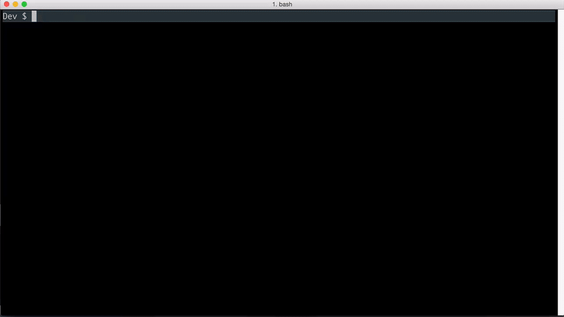

# choo-cli [](https://www.npmjs.com/package/choo-cli) [](https://travis-ci.org/trainyard/choo-cli) 

This is a tool for generating [choo](https://github.com/yoshuawuyts/choo) apps.



To Install (you'll need at least node v6):

```
npm install choo-cli -g
```

Using choo-cli will scaffold out a project and help generate additional files like models, pages, and elements.
It also generates common scripts you can use to build/test/serve your choo app.

```bash
# generate a new project folder,
# comes with package.json, readme, and recommended structure
choo new my-new-project

# generate a new page
choo generate page my-new-page

# generate a new model
choo generate model my-new-model

# generate a new element
choo generate element my-new-element

# run your app at localhost:8080
npm start

# build your app for production
npm run build:prod

# test your app
npm test

```

## Usage

Choo-cli runs off of node and npm, you can install choo-cli globably with the
following command:


The basic signature of a choo-cli command look like this:
```bash
$ choo <command> <name> [options]
```

For example to create a new project skeleton we can run:

```bash
$ choo new my-project
```

You can now cd into my-project

```bash
$ cd my-project
```

Choo-cli will create a directory structure that for slim
applications and reusability.

```txt
assets/        images and fonts, if you have any
elements/      standalone application-specific elements
lib/           generalized components, should be moved out of project later
models/        choo models
pages/         views that are directly mounted on the router
scripts/       shell scripts, to be interfaced with through `npm scripts`
client.js      main application entry; programmatic manifest file
package.json   manifest file
```

## Custom templates

You can also install custom templates from Github, like this

```bash
$ choo new <project> from <github-user>/<github-repo>
```

Custom templates must have `ejs` templating syntax.

## Generators

You can use choo-cli to generate pieces of your project as you are developing.
For example you can generate

Pages
```bash
$ choo generate page my-page
```

Models
```bash
$ choo generate model my-model
```

Elements
```bash
$ choo generate element my-element
```

## npm scripts

Choo-cli was made for generating choo projects and code, and leverages npm scripts
for certain project task. So in our project a set of npm scripts have already
been generated that perform various tasks such as testing/serving/building/etc.

At any time you can review the complete list of `npm scripts` available by viewing
[package.json](./package.json) or by running the following command:

```
$ npm run
```

Here is complete list the the commands and their function
- start - start dev server at [localhost:8080](https://localhost:8080)
- build:prod - builds your project to deploy to a server
- test - runs unit tests, for now it will just run linting.
- lint - runs eslint against your code

So for example you can run `npm start` to start a dev server. You can now see your
app running at [localhost:8080](https://localhost:8080)
first time this will pull in your node deps and start a budo server

## License
MIT &copy;
